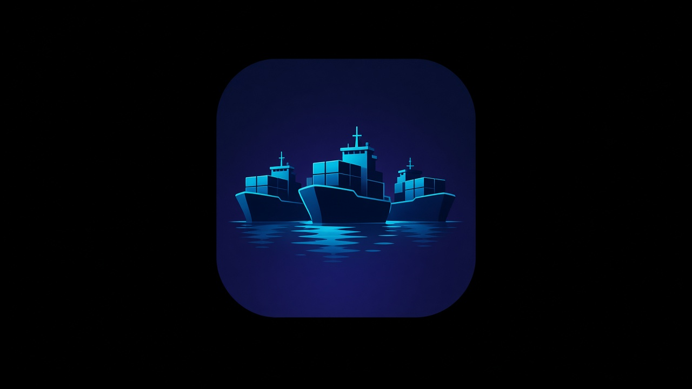

# ComfyFleet

The **manager** image serves the control UI and talks to the host Docker engine. Two **instance** images run ComfyUI, one for each CUDA line. The manager starts sibling instance containers. It does not run a Docker daemon of its own.

The Docker socket mounted into the manager is **root-equivalent** on the host. Run the manager only on a machine you trust. `COMFYFLEET_PASSWORD` is required. If it is missing or empty, the manager refuses to start. Sign in in the browser, or send `Authorization: Bearer` with the same value. A trusted LAN is still recommended. Do not publish port **9100** or the ComfyUI ports (8188 and up) on the public internet. ComfyUI is not behind this login.

HTTP field names: [CONTROL_HTTP.md](CONTROL_HTTP.md).

## Images

Two primary instance lines, plus the manager. [`.github/workflows/publish-images.yml`](.github/workflows/publish-images.yml) publishes all three to GHCR from `main`. All are `linux/amd64`. The manager image is Debian bookworm-slim and its Python is unchanged.

| Tag | Host driver | Stack |
|---|---|---|
| `comfyfleet:cu130` | **CUDA 13.0** | Default. ComfyUI v0.37.4, CPython 3.14.7, torch `2.13.0+cu130`. |
| `comfyfleet:cu124` | **CUDA 12.4** | ComfyUI v0.38.0, Debian bookworm CPython 3.11, torch `2.6.0+cu124`. |

`install.sh` asks which line to pull: **cu130**, **cu124**, or **both**. The choice is the TTY prompt, `--cuda-tag`, or `COMFYFLEET_CUDA_TAG` (the flag wins). When none of those set a choice, including a non-interactive run, the pull is **cu130** only and does not include the cu124 image. **both** pulls and tags each instance image. The manager `COMFYFLEET_CUDA_TAG` stays **cu130** unless `COMFYFLEET_INSTANCE_IMAGE` is already a cu124 ref and `COMFYFLEET_INSTANCE_DIGEST` is unset. Create can pick either line when that image is on the host engine. A mismatched line can fail when the instance starts. Match the host driver major.

Changing the CUDA line on an instance that already exists is a **recreate** (stop, then create with replace / `--force`, then start). `start`, `restart`, and Flags Apply keep the line stored at create. They do not swap tags.

Every instance create uses `--shm-size 8g` (Compose `shm_size: '8g'`), on both lines. Docker's 64MB `/dev/shm` is too small for ComfyUI.

Primary tags are `cu130` and `cu124`. Aliases are the same published digests, and `install.sh` applies them as local tags too: `:latest` → cu130, `:phase1` → cu124. A floating tag does not move a digest-pinned install.

| Image | Pull | Local tag from `install.sh` | Role |
|---|---|---|---|
| Manager | `ghcr.io/recognizeyourprivilege/comfyfleet-manager:latest@sha256:a26f075d8b31c44cbd080de0557ebe29a6617c2f848b5b244f461b6ac42b2cb8` | `comfyfleet-manager:latest` | Control HTTP and web UI. No CUDA stack. Includes `git` and `unzip` for create-time node seeding. |
| Instance cu130 | `ghcr.io/recognizeyourprivilege/comfyfleet:cu130@sha256:2032db1691256959cd619108376a7227f68d54e0135073dd941f1dc8d41d032e` | `comfyfleet:cu130`, `comfyfleet:latest` | ComfyUI v0.37.4. Python 3.14.7, CUDA 13.0 runtime, torch `2.13.0+cu130`. Host driver CUDA 13.0. |
| Instance cu124 | `ghcr.io/recognizeyourprivilege/comfyfleet:cu124@sha256:d2a5e55fcc348c0550e3d2e918bf36579a5a092d498070d63391cebffad71b76` | `comfyfleet:cu124`, `comfyfleet:phase1` | ComfyUI v0.38.0. CPython 3.11, CUDA 12.4 runtime, torch `2.6.0+cu124`. Host driver CUDA 12.4. |

Each publish also tags the git SHA (`<sha>` and `<sha>-cu130` for cu130, `<sha>-cu124` for cu124).

Override a pin without editing the script:

```bash
export COMFYFLEET_CUDA_TAG=cu130
export COMFYFLEET_INSTANCE_DIGEST=sha256:<instance-digest>
export COMFYFLEET_MANAGER_DIGEST=sha256:<manager-digest>
```

`COMFYFLEET_INSTANCE_IMAGE` and `COMFYFLEET_MANAGER_IMAGE` replace the full ref when you are not also passing `--cuda-tag`. The manager default, when `COMFYFLEET_INSTANCE_IMAGE` is unset, is `comfyfleet:cu130`. `install.sh` pulls the cu130 or cu124 digest above, or both instance digests when the choice is **both**, and tags the local names so a manager started without the variable still finds the image. The instance tag has to exist in the **host** engine before create, because sibling containers are started by that engine.

`install.sh`, `compose.yaml`, and the digests in the table pin an image by digest. A floating tag does not move a digest-pinned install.

### Instance image contents

Official CPython **3.14.7** (`python:3.14.7-slim-bookworm`) plus the NVIDIA CUDA **13.0** runtime (not the devel toolkit). Bookworm's Python 3.11 is not used. `/opt/venv` is that 3.14.7 interpreter, and the build fails if it is not. `gcc` is an image layer for Triton. The host does not repeat those steps. The host NVIDIA driver must support **CUDA 13.0**.

| Package | Pin |
|---|---|
| `cuda-libraries-13-0` | `13.0.3-1` |
| `cuda-cudart-13-0` | `13.0.96-1` |
| `libcudnn9-cuda-13` | `9.20.0.48-1` |

PyTorch wheels come from `https://download.pytorch.org/whl/cu130`: `torch==2.13.0+cu130`, `torchvision==0.28.0+cu130`, and `torchaudio==2.11.0+cu130`. Python is CPython 3.14.7. `/opt/comfyfleet/torch-constraints.txt` pins those wheels and `numpy==2.3.2`. `PIP_CONSTRAINT` points at that file, so a later `pip install` from Manager cannot replace them.

`torchaudio==2.11.0+cu130` is a presence pin on top of torch 2.13.0. PyTorch has not published torchaudio 2.13 on cu130 yet (the newest cu130 cp314 wheel is 2.11.0). TorchAudio 2.11 uses the stable ABI, so this wheel installs next to torch 2.13.0+cu130 and does not replace it. The package name has to be in `pip list` so Manager does not log that PyTorch is missing.

Pinned ComfyUI-Manager does not import torch to decide that PyTorch is installed. After `python -m pip install` (the `EXECUTE` line, including a package such as `cryptography`) it reads the `pip list` snapshot taken before that command. It logs `PyTorch is not installed` when `torch`, `torchvision`, or `torchaudio` is missing. The image installs all three cu130 wheels so that snapshot contains them.

`start` and `restart` alone keep the existing container layers. After the new digest is on the host engine, recreate the instance: **stop**, then **`create --force`** with the same workflow, GPUs, launch flags, and CUDA line, then **start**. Host model, custom-node, and output directories stay. Passing a different `cuda_tag` on that recreate is how the line changes. Apply does not change it.

ComfyUI v0.37.4 installs `comfy-kitchen==0.2.35`. On Python 3.14 that resolves to the cp312-abi3 manylinux wheel (the CUDA build). Torch 2.13 accepts PEP 585 `list[int]` / `list[bool]` custom-op annotations, so the torch 2.6 rewrite (`patch_comfy_kitchen_torch26.py`) is not in this image. The Triton backend in torch 2.13.0+cu130 (`triton==3.7.1`) JIT-compiles `driver.c`, which includes `Python.h`. Without `gcc` that compile raises `Failed to find C compiler. Please specify via CC environment variable.` The official 3.14.7 image ships `Python.h`. The image does not install Debian `python3-dev` (bookworm's headers are CPython 3.11), `g++`, `build-essential`, or `cuda-nvcc`. The image build does not `import comfy_kitchen`.

`llama-cpp-python` is not baked into this image. An optional later install into this venv uses the cu130 binary index, not cu124:

```bash
unset CXX CC CMAKE_ARGS
/opt/venv/bin/python -m pip install llama-cpp-python --only-binary=:all: --force-reinstall \
  --extra-index-url https://abetlen.github.io/llama-cpp-python/whl/cu130
```

Check with `/opt/venv/bin/python -c "from llama_cpp import Llama; print('ok')"`. A failure of that optional install is not a base-image failure.

Baked custom nodes (also `docker/PINS.txt`):

| Component | Pin |
|---|---|
| ComfyUI `v0.37.4` | `8ff6dc384ba5c410266b40e137799e049459d4f2` |
| ComfyUI-Manager | `14b5aaab711ad1f1306d420732a923fb058c44d7` |
| ComfyUI-Pixaroma `v1.4.181` | `9259bc49557a92e3fc14796999468c723bd1ecdd` |
| ComfyUI-ComfyDock | `3a9ff9eba897bf2388d6c1943b01d819ba05a0c6` |
| `RES4LYF` | `3d1d69da69ee47f7647d59e1bd0967e472fccc41` |
| numpy | `2.3.2` |

`git` is in the instance image so Manager can clone. The host `custom_nodes` mount hides the image folder. On every start the entrypoint symlinks baked nodes into that mount when the name is absent: `ComfyUI-Manager`, `ComfyUI-Pixaroma`, `ComfyUI-ComfyDock`, `RES4LYF`, and `comfyfleet_default_workflow` (loader only; it is not a workflow). A real directory at one of those names is left alone.

`RES4LYF` imports `cv2`. Its `opencv-python` wheel needs `libxcb.so.1` on bookworm-slim. The image installs `libxcb1`, `libx11-6`, `libxext6`, `libice6`, `libsm6`, `libglib2.0-0`, and `libgl1`, and the build imports `cv2` so a missing library fails the build.

### cu124 instance image

`Dockerfile.cu124`, pins in `docker/PINS.cu124.txt`. Primary tag `comfyfleet:cu124`. Host driver **CUDA 12.4**. Debian bookworm CPython 3.11 (not 3.14). `gcc` and `python3-dev` are installed for Triton. `--shm-size 8g` is still set at create, not in the image.

| Package | Pin |
|---|---|
| `cuda-libraries-12-4` | `12.4.1-1` |
| `cuda-cudart-12-4` | `12.4.127-1` |
| `libcudnn9-cuda-12` | `9.1.0.70-1` |
| torch | `torch==2.6.0+cu124` |
| torchvision | `torchvision==0.21.0+cu124` |
| torchaudio | `torchaudio==2.6.0+cu124` |
| index | `https://download.pytorch.org/whl/cu124` |
| numpy | `numpy==2.2.6` |
| ComfyUI `v0.38.0` | `6b747c0428c343e1417219641db93a4fb7cb69ae` |

The same baked custom nodes as the cu130 line (Manager `14b5aaab`, Pixaroma, ComfyDock, RES4LYF). `comfy-kitchen==0.2.36` is the pure-Python wheel, then `docker/patch_comfy_kitchen_torch26.py` rewrites annotations that torch 2.6 rejects. That patch is not applied on the cu130 line. Trusted install (`COMFYFLEET_TRUSTED_INSTALL`) is the same patch on both lines. All three torch packages are in `pip list`.

An optional llama install on this line uses the cu124 index, not cu130:

```bash
unset CXX CC CMAKE_ARGS
/opt/venv/bin/python -m pip install llama-cpp-python --only-binary=:all: --force-reinstall \
  --extra-index-url https://abetlen.github.io/llama-cpp-python/whl/cu124
```

That package is not baked. A failed optional install is not a base-image failure.

There is no baked default workflow. Omitting the workflow fails create. `examples/workflow.example.json` is documentation only. `.dockerignore` excludes `examples/`.

### Manager git URL install

The instance entrypoint writes `/opt/ComfyUI/user/__manager/config.ini` and exports `COMFYFLEET_TRUSTED_INSTALL=1` before it execs ComfyUI:

```ini
[default]
allow_git_url_install = true
allow_pip_install = true
security_level = normal
```

`--listen` stays `0.0.0.0` so Docker can publish the instance port. `docker/patch_manager_trusted_install.py` skips Manager's loopback check only when `COMFYFLEET_TRUSTED_INSTALL=1`. `0.0.0.0` is what lets Docker publish the instance port onto the docker.sock LAN. A directory you place at `custom_nodes/ComfyUI-Manager` is left alone and does not include this patch. After an in-container `git pull` of the baked Manager, run `python /opt/comfyfleet/patch_manager_trusted_install.py` again.

An open gate answers `POST /customnode/install/git_url` with **400** and `expected JSON object with a 'url' field` when the body is `{}`. A closed gate returns **403**.

## Host

- Linux with Docker.
- A working NVIDIA driver. `nvidia-smi` must succeed on the host. Pick **cu130** when the driver supports CUDA 13.0, or **cu124** when it supports CUDA 12.4. The host does not need the CUDA toolkit installed. The wrong line can fail at runtime.
- The [NVIDIA Container Toolkit](https://docs.nvidia.com/datacenter/cloud-native/container-toolkit/latest/install-guide.html), so `docker create --gpus device=N` works.
- Permission to create `/home/models`, `/home/custom_nodes_<name>`, and `/home/files/<name>/...`.

The host does not need Debian or a local image rebuild. It does need a driver that matches the instance line you pick (CUDA 13.0 or CUDA 12.4).

## Install

From a checkout, replace `192.168.1.20` with the address browsers on your LAN use:

```bash
export COMFYFLEET_PASSWORD=replace-with-a-long-secret
export COMFYFLEET_PUBLIC_HOST=192.168.1.20
./install.sh
# ./install.sh --cuda-tag cu124
# ./install.sh --cuda-tag both
# COMFYFLEET_CUDA_TAG=cu124 ./install.sh
```

On a terminal the prompt is `CUDA tag [cu130]:` with **cu130** (host driver CUDA 13.0), **cu124** (host driver CUDA 12.4), or **both** (pull each instance image). Enter, or a run that never sets the choice, pulls **cu130** only. `--cuda-tag` and `COMFYFLEET_CUDA_TAG` skip the prompt (`cu130`, `cu124`, or `both`). The flag wins. **both** pulls and tags each instance image (`comfyfleet:cu130` and `comfyfleet:latest`, `comfyfleet:cu124` and `comfyfleet:phase1`). The manager `COMFYFLEET_CUDA_TAG` stays **cu130** unless `COMFYFLEET_INSTANCE_IMAGE` is already a cu124 ref and `COMFYFLEET_INSTANCE_DIGEST` is unset. Create can pick either line.

Without a checkout:

```bash
curl -fsSL https://raw.githubusercontent.com/RecognizeYourPrivilege/ComfyFleet/main/install.sh \
  | COMFYFLEET_PASSWORD=replace-with-a-long-secret COMFYFLEET_PUBLIC_HOST=192.168.1.20 bash
```

That pipe is not a terminal, so it pulls **cu130** only. Pass a line with `bash -s -- --cuda-tag cu124` or `bash -s -- --cuda-tag both`, or set `COMFYFLEET_CUDA_TAG` on the same command.

Or Compose (the script still pulls the instance image, or both instance images when the tag is **both**; neither is a compose service):

```bash
export COMFYFLEET_PASSWORD=replace-with-a-long-secret
export COMFYFLEET_PUBLIC_HOST=192.168.1.20
./install.sh --compose
```

`replace-with-a-long-secret` is a placeholder. Open `http://192.168.1.20:9100/`. The script pulls the manager and the chosen instance line (both instance images when the choice is **both**), tags the local names, removes an existing `comfyfleet-manager` container, and starts the manager with `--gpus all`, `-p 9100:9100`, the Docker socket, `/home`, `COMFYFLEET_PASSWORD`, `COMFYFLEET_PUBLIC_HOST`, `COMFYFLEET_INSTANCE_IMAGE`, and `COMFYFLEET_CUDA_TAG`. Re-running it updates the manager. It does not delete workflow instances. To wipe instances and install again, see [WIPE_AND_FRESH_INSTALL.md](WIPE_AND_FRESH_INSTALL.md).

### Manual run

Same start without the script, for the cu130 default. Pull that instance digest and the manager digest, tag the local names (including the `latest` alias), then run the manager:

```bash
docker pull ghcr.io/recognizeyourprivilege/comfyfleet:cu130@sha256:2032db1691256959cd619108376a7227f68d54e0135073dd941f1dc8d41d032e
docker pull ghcr.io/recognizeyourprivilege/comfyfleet-manager:latest@sha256:a26f075d8b31c44cbd080de0557ebe29a6617c2f848b5b244f461b6ac42b2cb8
docker tag ghcr.io/recognizeyourprivilege/comfyfleet:cu130@sha256:2032db1691256959cd619108376a7227f68d54e0135073dd941f1dc8d41d032e comfyfleet:cu130
docker tag ghcr.io/recognizeyourprivilege/comfyfleet:cu130@sha256:2032db1691256959cd619108376a7227f68d54e0135073dd941f1dc8d41d032e comfyfleet:latest
docker tag ghcr.io/recognizeyourprivilege/comfyfleet-manager:latest@sha256:a26f075d8b31c44cbd080de0557ebe29a6617c2f848b5b244f461b6ac42b2cb8 comfyfleet-manager:latest

docker run -d --name comfyfleet-manager \
  --restart unless-stopped \
  --gpus all \
  -p 9100:9100 \
  -v /var/run/docker.sock:/var/run/docker.sock \
  -v /home:/home \
  -e COMFYFLEET_PASSWORD=replace-with-a-long-secret \
  -e COMFYFLEET_PUBLIC_HOST=192.168.1.20 \
  -e COMFYFLEET_CUDA_TAG=cu130 \
  -e COMFYFLEET_INSTANCE_IMAGE=ghcr.io/recognizeyourprivilege/comfyfleet:cu130@sha256:2032db1691256959cd619108376a7227f68d54e0135073dd941f1dc8d41d032e \
  ghcr.io/recognizeyourprivilege/comfyfleet-manager:latest@sha256:a26f075d8b31c44cbd080de0557ebe29a6617c2f848b5b244f461b6ac42b2cb8
```

For a CUDA 12.4 host, pull `ghcr.io/recognizeyourprivilege/comfyfleet:cu124@sha256:d2a5e55fcc348c0550e3d2e918bf36579a5a092d498070d63391cebffad71b76`, tag `comfyfleet:cu124` and `comfyfleet:phase1`, and set `COMFYFLEET_CUDA_TAG=cu124` with that ref as `COMFYFLEET_INSTANCE_IMAGE`. To mirror `--cuda-tag both`, pull and tag that image as well and leave `COMFYFLEET_CUDA_TAG=cu130`.

[compose.yaml](compose.yaml) is the same service. It does not pull the instance image:

```bash
export COMFYFLEET_PASSWORD=replace-with-a-long-secret
export COMFYFLEET_PUBLIC_HOST=192.168.1.20
docker pull ghcr.io/recognizeyourprivilege/comfyfleet:cu130@sha256:2032db1691256959cd619108376a7227f68d54e0135073dd941f1dc8d41d032e
docker compose up -d
```

The entrypoint runs `comfyfleet ui` on `0.0.0.0:9100`. Health is `GET /api/health`. `COMFYFLEET_BIND_HOST` and `COMFYFLEET_BIND_PORT` change the bind. `docker run` still requires `-e COMFYFLEET_PASSWORD=...` when you pass a subcommand such as `list`.

`-v /var/run/docker.sock:/var/run/docker.sock` is how the manager creates sibling containers. The image user is root, which can use a host socket mode `660` group `docker`. If the socket is missing, create and start fail and the UI still comes up so you can see the error.

The GPU probe is `nvidia-smi` inside the manager. The manager image has no CUDA libraries. `--gpus all` (compose: `gpus: all`) mounts the host driver into the manager. Instance containers get `--gpus device=N` and `--shm-size 8g` (Compose `shm_size: '8g'`). Without the toolkit, `/api/gpus` returns 503 and create fails.

### Mounts

Create writes under `/home` in the manager, then passes those same paths to `docker create -v`. Mount the host parent:

```text
-v /home:/home
```

| Host path | Instance container |
|---|---|
| `/home/models` | `/opt/ComfyUI/models` (shared, read-write) |
| `/home/custom_nodes_<name>` | `/opt/ComfyUI/custom_nodes` |
| `/home/files/<name>/input` | `/opt/ComfyUI/input` |
| `/home/files/<name>/output` | `/opt/ComfyUI/output` |
| `/home/files/<name>/temp` | `/opt/ComfyUI/temp` |
| `/home/files/<name>` | `/opt/comfyfleet/instance` |

`/home/models` is shared and read-write. If `/home` is not a bind mount, the manager warns at startup.

### Create-time custom nodes

Optional. Leave the git URL list and the zip blank to skip them. Create still requires a workflow and does not fail because those fields were empty. `install_missing_from_workflow` defaults to true and installs only nodes referenced by **that** workflow JSON that are not already in the baked image or on the volume, via Manager's git-URL install (`COMFYFLEET_TRUSTED_INSTALL`). It does not install the Manager registry. A failed clone, extract, or install is a `warnings` entry. The instance is still created. No new instance image is published for this. Delete is `POST /api/instances/{name}/delete` (container and fleet record only). Host mounts, including `custom_nodes`, stay.

## Use

Open the manager URL and sign in with `COMFYFLEET_PASSWORD`. Upload a workflow JSON, pick the CUDA line (`cu130` for host driver CUDA 13.0, `cu124` for CUDA 12.4), pick GPUs, then create. The instance card shows the line. New instances stay stopped. Each instance card has an icon row: **Start**, **Stop**, **Force stop** (`docker kill`), **Open** (a shell proxied by the manager), **Open Comfy**, **Flags**, and **Delete**. **Open Comfy** uses `window.location.hostname` plus the instance's published port and is enabled only while the instance is running. **Flags** (pencil) reveals that instance's Comfy arguments, including **Reserve VRAM** and **VRAM headroom** (GB, sent as `--reserve-vram` and `--vram-headroom`). The panel stays open until you close it. The same two numbers are in the create sheet under **Advanced / ComfyUI flags**, next to the VRAM choices. **Delete** asks for confirmation, then removes that container and its fleet record. Host files stay. The create sheet keeps Comfy args under **Advanced / ComfyUI flags**, collapsed until you open them.

On a multi-GPU host, create asks which GPUs to attach. A single GPU still has to be selected.

CLI inside the manager (local process, not the browser session):

```bash
docker exec -it comfyfleet-manager comfyfleet create --workflow /home/files/incoming/portrait.json --gpu 0
docker exec -it comfyfleet-manager comfyfleet list
docker exec -it comfyfleet-manager comfyfleet start portrait
docker exec -it comfyfleet-manager comfyfleet stop portrait
```

`start`, `stop`, and `restart` do not rebuild the instance image and do not change its CUDA line. On more than one GPU, pass `--gpu 0` or `--gpus 0,1`. `--cuda-tag cu130` or `--cuda-tag cu124` selects the line (`--image` is a full ref override). `--force` replaces a **stopped** instance of the same sanitized name. Use that recreate to change the CUDA line. Flags Apply keeps the line.

The container name is the workflow filename stem, lowercased, with characters outside `[a-z0-9_-]` turned into `_`, truncated at 63 characters. Ports start at **8188**. Changing GPUs or launch flags is a recreate (`--force` on a stopped instance). ComfyUI runs as `python main.py --listen 0.0.0.0 --port 8188` plus the saved flags. Pasted `--listen` or `--port` in extra args are removed. On NVIDIA, `--lowvram` does nothing while dynamic VRAM is enabled, so a 12GB GPU also needs `--disable-dynamic-vram`.

`COMFYFLEET_MAX_CONCURRENT` set to a positive integer refuses a start that would exceed the GPU count. The default records a warning and continues. Containers are created with `--restart no` and `--shm-size 8g`. Docker's default 64MB `/dev/shm` is too small for ComfyUI. `start` sets `--restart unless-stopped` and leaves the shared-memory size from create in place.

To move an instance onto a newer digest of the **same** CUDA line, re-run `install.sh` with a new `COMFYFLEET_INSTANCE_DIGEST` (and the same `COMFYFLEET_CUDA_TAG`), then stop, `create --force`, and start. A floating tag does not move a digest-pinned install. To change cu130 versus cu124, pass the other `--cuda-tag` on that recreate. `start` or `restart` alone keeps the old layers and the old line.

## API

Same-origin. No CORS headers. Pages call `/api/...` with `credentials: "same-origin"`.

| Method | Path | Auth | Behavior |
|---|---|---|---|
| `GET` | `/api/health` | no | Liveness. No fleet list and no password |
| `POST` | `/api/login` | no | Body `{"password":"..."}`. Sets the session cookie |
| `POST` | `/api/logout` | no | Clears the session |
| `GET` | `/api/gpus` | yes | **503** when `nvidia-smi` fails |
| `GET` | `/api/instances` | yes | `name`, `status`, `port`, `gpus`, `cuda_tag`, `image` |
| `POST` | `/api/instances` | yes | Create. Workflow required. `cuda_tag` is `cu130` or `cu124`. `start` defaults to false |
| `POST` | `/api/instances/{name}/start` | yes | Start |
| `POST` | `/api/instances/{name}/stop` | yes | Stop |
| `POST` | `/api/instances/{name}/delete` | yes | Remove that container. Host mounts stay |

Protected routes accept the session cookie or `Authorization: Bearer`. A missing credential is **401**.

| Situation | What you see |
|---|---|
| `COMFYFLEET_PASSWORD` missing or empty | Manager exits. The UI does not come up. |
| Wrong password | **401** |
| `/var/run/docker.sock` missing | Create and start fail. The UI still loads. |
| `nvidia-smi` missing | Create fails. `/api/gpus` returns 503. Pass `--gpus all`. |
| Workflow missing | Create is refused. |

## Development / optional

Host `pip install` is for contributors and CI. It is not required to run a fleet.

```bash
python -m pip install .
COMFYFLEET_PASSWORD=replace-with-a-long-secret comfyfleet ui --host 127.0.0.1 --port 9100
python -m unittest discover -s tests
```

`comfyfleet ui` on the host also refuses to start without `COMFYFLEET_PASSWORD`. Host commands such as `comfyfleet create` do not go through HTTP Auth.

`scripts/manager-smoke.sh` builds `comfyfleet-manager:latest`, starts it with a placeholder password, and requests `/api/health` and `/login`.

### Local image rebuild

Optional. Use this when you are changing the Dockerfiles. No GPU is required for the build: the instance Dockerfile does not import `comfy_kitchen` during the build. Torch wheels are large.

```bash
docker build -f Dockerfile -t comfyfleet:cu130 .
docker build -f Dockerfile.cu124 -t comfyfleet:cu124 .
docker build -f Dockerfile.manager -t comfyfleet-manager:latest .
export COMFYFLEET_PASSWORD=replace-with-a-long-secret
export COMFYFLEET_PUBLIC_HOST=192.168.1.20
export COMFYFLEET_INSTANCE_IMAGE=comfyfleet:cu130
export COMFYFLEET_CUDA_TAG=cu130
export COMFYFLEET_MANAGER_IMAGE=comfyfleet-manager:latest
docker compose -f compose.yaml -f compose.build.yaml up -d --build
```

`compose.build.yaml` points the manager at the local tags. The instance images are still the separate `docker build -t comfyfleet:cu130 .` and `docker build -f Dockerfile.cu124 -t comfyfleet:cu124 .` commands above. Recreate running instances after that rebuild: stop, `create --force`, start. `start` or `restart` alone keeps the old layers. Changing the CUDA line is that same recreate with the other tag, not Apply.

### Publish to GHCR

[`.github/workflows/publish-images.yml`](.github/workflows/publish-images.yml) builds `Dockerfile` (cu130), `Dockerfile.cu124`, and `Dockerfile.manager` on `ubuntu-24.04` (`linux/amd64`) and pushes to GHCR. The instance job is a two-leg matrix. It runs on pushes to `main` that change image inputs, and from `workflow_dispatch`. It does not run on pull requests. The runner has no GPU. Each instance leg timeout is 180 minutes.

| Image | Tags |
|---|---|
| `ghcr.io/recognizeyourprivilege/comfyfleet` | `cu130`, `cu124`, `latest` (alias of cu130), `phase1` (alias of cu124), `<git sha>`, `<git sha>-cu130`, `<git sha>-cu124` |
| `ghcr.io/recognizeyourprivilege/comfyfleet-manager` | `latest`, `<git sha>` |

The workflow logs in with `GITHUB_TOKEN` (`packages: write`). The job summary prints the manager digest and one instance-matrix digest. Copy the cu130 and cu124 digests from the instance job logs. Those digests are not committed automatically. When a publish should move the install pin, copy them into this file, `install.sh`, and `compose.yaml`.

Before operators can pull:

1. Merge the workflow to `main`. This pull request does not publish images.
2. Wait until both jobs succeed. The fallback is `scripts/publish-images.sh` on a machine with more free disk. No GPU is required there either.
3. A personal-account package is private on first publish. Set each package to public, or anonymous `docker pull` is denied. Making a package public cannot be undone.

Manual push. The password is a PAT, not your GitHub password: classic `write:packages`, or a fine-grained token with Packages read and write.

```bash
echo "$GHCR_TOKEN" | docker login ghcr.io -u YOUR_GITHUB_USERNAME --password-stdin
scripts/publish-images.sh
```

`scripts/publish-images.sh` runs `docker buildx build --platform linux/amd64 --push` for `Dockerfile`, `Dockerfile.cu124`, and `Dockerfile.manager`, then prints digests for both instance lines and the manager.
